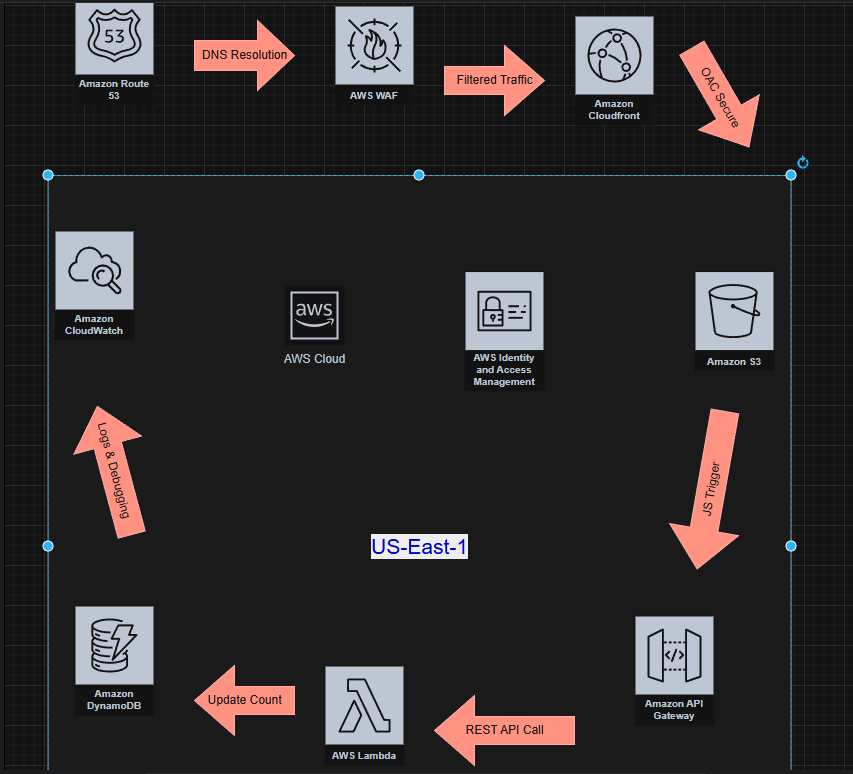

# Technical Case Study: Serverless Cloud Resume
**Project Name:** Automated Portfolio Deployment  
**Author:** Xavier  
**Total Build Time:** 7 Months (including research, troubleshooting, and frustration breaks)

## Problem Overview
I created this project to stand out when applying for tech roles. I want to become a Cloud Engineer, so I decided to build this project to start understanding the DevOps mindset. My goal was to be able to make changes in my website files and, within minutes of pushing commands, have the website update and reflect those changes globally.

This wasn't a quick process. It was a 7-month journey of hitting technical walls, walking away in frustration for weeks at a time, and returning to solve the complex IAM, networking, and state-management gaps that basic tutorials often ignore.

## Technical Decisions (The "Why")
**Why Terraform?** I chose Terraform because it allows me to create, destroy, and recreate my stacks within minutes. Using S3 and DynamoDB for state storage and locking ensures that my infrastructure is safe and consistent.
**Why Serverless?** I wanted to minimize costs and maintenance. Using S3 for static hosting and CloudFront for CDN allows me to have a highly available website with minimal overhead. Lambda functions enable me to add dynamic features like visitor counters without managing servers.
**Why CloudFront OAC?** Focusing on security, I decided to make my S3 bucket private. Origin Access Control (OAC) ensures that users must go through CloudFront to see the website, providing better security and speed.                                                                                                                                                                    **Why GitHub Actions?** Automating the deployment process allows me to implement a CI/CD pipeline. Every time I push changes to my repository, the website is automatically updated without manual intervention.

## Troubleshooting & Mistakes 
To prove the "hand-built" nature of this project, I am documenting the specific failures that took weeks to resolve. This is the real-world experience gained during this build.

### 1. The "Invisible Wall" (S3 403 Forbidden)
**The Error:** Site returned 403 Forbidden despite a "perfect" Bucket Policy.
**The Problem:** AWS Block Public Access (BPA) settings at the account level were overriding my bucket-level permissions. It acts like a master lock that overrides any policy you write.
**The Resolution:** I had to manually (and via Terraform) disable all four BPA master locks before my policy could work.

### 2. The Browser "Security Guard" (CORS Errors)
**The Error:** Access to fetch at... blocked by CORS policy.
**The Problem:** My website (on S3) was trying to talk to a different domain (API Gateway). For security, browsers block this unless the API explicitly allows the S3 origin.
**The Resolution:** This was a two-part fix. I enabled CORS in API Gateway and ensured my Lambda function returned the Access-Control-Allow-Origin header in its response.

### 3. The "Silent Failure" (Lambda & CloudWatch)
**The Error:** API returned 200 OK, but the DynamoDB table remained empty.
**The Problem:** There were no errors on the website, but the Lambda function lacked the permission to talk to DynamoDB.
**The Resolution:** I learned to use CloudWatch Logs to find the AccessDeniedException. I fixed the IAM Policy attached to the Lambda's role to include dynamodb:PutItem.

### 4. The Terraform "Lock" Trap
**The Error:** Error: Error acquiring the state lock.
**The Problem:** An interrupted VS Code terminal session left a "Lock" record in my DynamoDB state-locking table, preventing any new changes.
**The Resolution:** I had to dive into the DynamoDB console, locate the LockID, and run terraform force-unlock <ID> manually. This taught me the critical importance of State Management.

### 5. The Invalidation Gap (Stale Content)
**The Error:** GitHub Actions showed "Green," but the website wouldn't update.
**The Problem:** CloudFront was caching the old version of the site globally. S3 was updated, but the "Edge" was still old.
**The Resolution:** I integrated an automated aws cloudfront create-invalidation step into the CI/CD pipeline and updated the CICD-Role IAM Policy to allow cloudfront:CreateInvalidation.

## Project Timeline & Persistence
This timeline reflects the reality of self-taught Cloud Engineering:
**Months 1-2:** Learning Terraform syntax and Route 53 domain verification.
**Months 3-4:** Building the "Visitor Counter" backend. First encounters with "Silent Failures" and learning to read CloudWatch logs.
**Month 5:** The Security Wall. Dealing with CORS and IAM Access Denied errors. This is where most frustration occurred.
**Month 6:** Automation. Setting up GitHub Actions, dealing with OIDC authentication, and solving Terraform Lock issues.
**Month 7:** Production Polish. Implementing CloudFront Invalidation and writing this professional documentation.

## Core Competencies Gained
**Infrastructure as Code:** Managing remote state and concurrency locking.
**Cloud Security:** Hardening S3 with OAC and Principle of Least Privilege IAM policies.
**CI/CD:** Automating deployments via GitHub Actions and OIDC.
**Serverless Architecture:** Integrating API Gateway, Lambda, and DynamoDB.

**Infrastructure Diagram**

